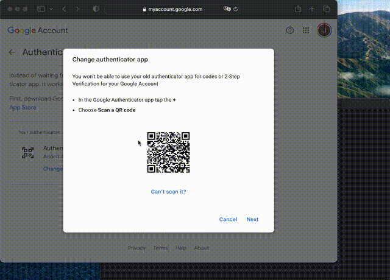

# pyauthenticator
[](https://github.com/pyscioffice/pyauthenticator/actions/workflows/unittest.yml)
[](https://coveralls.io/github/jan-janssen/pyauthenticator?branch=main)
[](https://github.com/psf/black)

Similar to the Google authenticator just written in Python. With more and more services requiring two factor
authentication without supporting application specific passwords or other forms of token based authenication
suitable for automation this python packages allows to generate two factor authentication codes on the commandline
or in python.

 

## Installation
Install via conda:
```
>>> conda install -c conda-forge pyauthenticator
```

Install via pip:
```
>>> pip install pyauthenticator
```

## Command Line
Get help and a list of all available options:
```
>>> pyauthenticator --help

usage: pyauthenticator [-h] [-qr] [-a ADD] service

positional arguments:
  service            Service to generate optauth code for. Currently no
                     service is defined in the ~/.pyauthenticator config file.

options:
  -h, --help         show this help message and exit
  -qr, --qrcode      Generate qrcode as <service.png> file.
  -a ADD, --add ADD  Add service by providing the <qrcode.png> file as
                     additional argument.
```

Add `google` as new service after saving the qrcode to `Screenshot 2023-07-02 at 12.45.09.png`:
```
>>> pyauthenticator google --add ~/Desktop/Screenshot\ 2023-07-02\ at\ 12.45.09.png

The service 'google' was added, from file </Users/jan/Desktop/Screenshot 2023-07-02 at 12.45.09.png>
```

Afterwards new authentication codes can be generated for the service `google` using:
```
>>> pyauthenticator google

087078
```
Beyond google, `pyauthenticator` works for any service which implements the two factor authentication. 

## Python Interface
The same functionality is available via the python interface:
```
from pyauthenticator import get_two_factor_code
get_two_factor_code(service)
```

## Configuration
The configuration is stored in `~/.pyauthenticator` it is written in the JSON format. For a given service like `github`
the config file contains:
```
{"google": "otpauth://totp/Google:<username>?secret=<secret>&issuer=Google"}
```
With the Google username `<username>` and the corresponding secret `<secret>` being contained in the QR code.
